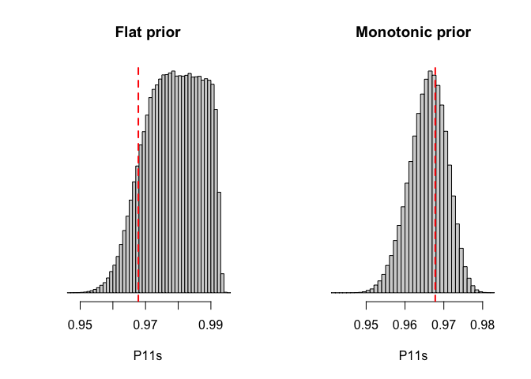
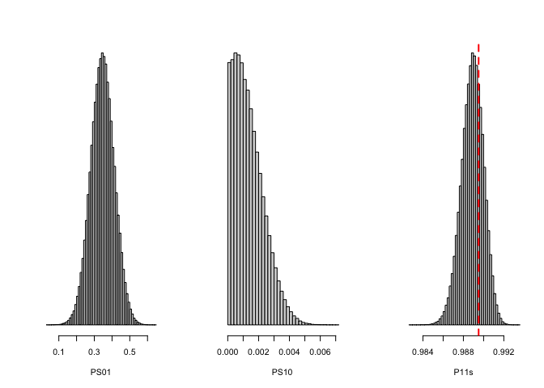

<!-- README.md is generated from README.Rmd. Please edit that file -->

# generalizing: Generalizing Experimental Results By Leveraging Knowledge of Mechanisms

<!-- badges: start -->

<!-- badges: end -->

`generalizing` implements methods for generalizing experimental results
leveraging the invariance of probabilities of causation, as discussed in
[Cinelli, C. and Pearl, J. (2020+) “Generalizing Experimental Results By
Leveraging Knowledge of Mechanisms.” European Journal of Epidemiology
(accepted).](https://ftp.cs.ucla.edu/pub/stat_ser/r492.pdf)

## Development version

To install the development version on GitHub make sure you have the
package `devtools` installed.

``` r
# install.packages("devtools") 
devtools::install_github("carloscinelli/generalizing")
```

## CRAN

The CRAN version should be available soon.

## Basic Usage

``` r
# loads package
library(generalizing)

# loads data
data("Aceh")
data("West.Java")
data("Sarlahi")

#### ACEH to WEST JAVA 

# flat prior
Aceh_to_WJ   <- generalize(sources = Aceh, target = West.Java, n.iter = 1e5)

# monotonic prior
Aceh_to_WJ_m <- generalize(sources = Aceh, target = West.Java, 
                           monotonic = TRUE, n.iter = 1e5) 


# posterior samples histograms
par(mfrow = c(1,2))
mark <- West.Java$n1/West.Java$N1

## hist of P(Y1 = 1) for West Java -- flat prior
hist(Aceh_to_WJ, main = "Flat prior")
abline(v = mark, col = "red", lty = 2, lwd = 2)

## hist of P(Y1 = 1) for West Java -- monotonic prior
hist(Aceh_to_WJ_m, main = "Monotonic prior")
abline(v = mark, col = "red", lty = 2, lwd = 2)
```



``` r

#### ACEH + WEST JAVA to SARLAHI
AcehWJ_to_Sarlahi   <- generalize(sources = list(Aceh, West.Java), 
                                  target = Sarlahi, 
                                  n.iter = 1e5)
# posterior samples histograms
par(mfrow = c(1, 3))
mark <- Sarlahi$n1/Sarlahi$N1

## hist prob of sufficient for saving
hist(AcehWJ_to_Sarlahi, var = "PS01")

## hist prob of sufficient for harming
hist(AcehWJ_to_Sarlahi, var = "PS10")

## hist of P(Y1 = 1) for Sarlahi
hist(AcehWJ_to_Sarlahi, var = "p11s")
abline(v = mark, col = "red", lty = 2, lwd = 2)
```


